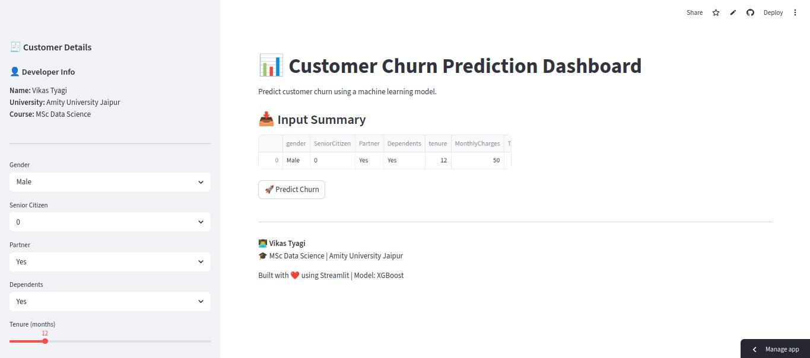
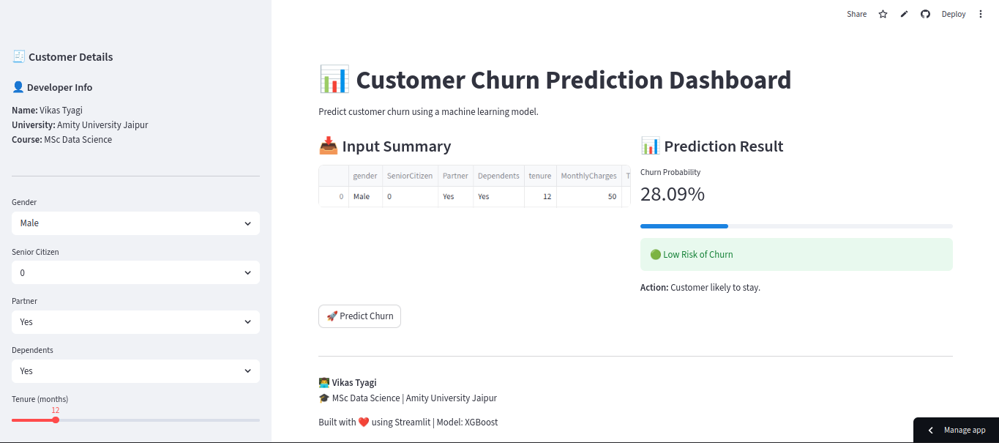

# Customer Churn ML Project
---

**Developed by:** Mr. Vikas Tyagi

**Course:** M.Sc Data Science

**University:** Amity University Rajasthan

---

## Live Demo

[Customer Churn App (Deployed)](https://customer-churn-ml-spgrbzztsvzhkos7fdncuv.streamlit.app/)

---

## 📸 App Preview





---

## 📌 Problem Statement
Predict whether a customer will churn based on their usage and subscription details.

---

## 📊 Dataset
- Telco Customer Churn Dataset
- Features include tenure, charges, contract type, etc.

---

## ⚙️ Tech Stack
- Python
- Pandas, NumPy
- Scikit-learn, XGBoost
- Matplotlib, Seaborn
- Joblib
---

## 🔍 Workflow
1. Data Cleaning
2. Exploratory Data Analysis
3. Feature Engineering
4. Model Training (Random Forest)
5. Evaluation (ROC-AUC, F1 Score)

---

## 📈 Results
- ROC-AUC Score: ~0.81, after feature engineering: 0.91
- Key Features:
  - Contract Type
  - Monthly Charges
  - Tenure

---

## 🚀 How to Run

```bash
git clone <repo>
cd customer-churn-ml
pip install -r requirements.txt
python main.py

streamlit run app/app.py
```
